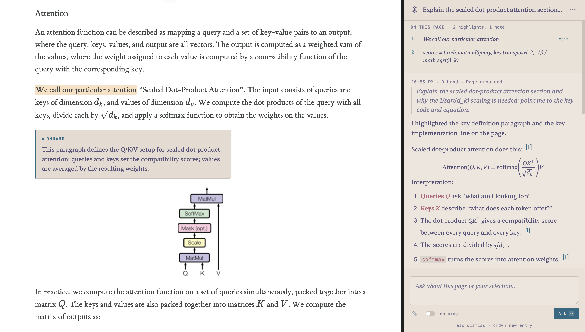

# Onhand

Onhand is a contextual AI assistant for learning and research. The goal is to help users understand what is already open on their computer instead of pulling them away into a separate chatbot interface.

The intended experience is:
- invoke Onhand from a global shortcut
- ask a question about the page, PDF, file, or material already in front of you
- have Onhand point to the relevant place, scroll to it, highlight it, and explain it in context
- save the session so it can be replayed later with the relevant artifacts restored

## Onhand at work

<p align="center">
  
</p>

<p align="center"><em>Onhand grounding an explanation in the page the user already has open.</em></p>

## Current status

This repository is now organized around **Onhand**, but the main implemented subsystem today is still the **browser grounding layer**:

1. a Chromium extension that uses `chrome.debugger`
2. a localhost bridge server
3. a pi extension that exposes browser tools inside pi

That stack already lets pi inspect and act on the user's current Chromium/Helium browser session without requiring `--remote-debugging-port`.

The broader product plan lives in:

- `docs/ONHAND_PLAN.md`

## Current repository layout

- `apps/desktop/` - early Electron desktop shell for Onhand
- `docs/ONHAND_PLAN.md` - product and implementation plan
- `packages/browser-bridge/` - local HTTP + WebSocket bridge server
- `packages/browser-extension/` - unpacked Chromium extension
- `packages/pi-extension/` - pi extension tools for the browser bridge

## Browser bridge MVP

Implemented right now:

- list browser windows and tabs
- activate/focus a tab
- navigate the current tab or open a URL in a new tab
- inspect cookies for a tab
- wait for a selector in a tab
- click or type by CSS selector
- find elements by visible text/label/placeholder
- click by visible text
- type by label/placeholder/aria-label
- interactive element picker overlay in the visible browser
- collect console messages, warnings, and exceptions from a tab
- collect network requests/responses/failures from a tab, with optional headers and response bodies
- run JavaScript in a tab via `Runtime.evaluate`
- fetch outer HTML via `DOM.getDocument` + `DOM.getOuterHTML`
- extract readable page content as markdown
- capture screenshots of a visible tab
- expose pi tools for the above

## Security model

- bridge binds to `127.0.0.1`
- bridge uses a bearer token stored in a local config file
- browser extension connects with that token over WebSocket
- pi extension reads the same config file by default

**Compatibility note:** the browser bridge currently still uses the legacy config path:

```text
~/.config/pi-browser-bridge/config.json
```

That keeps the current setup working while the repo structure and product direction shift toward Onhand.

## Setup

### 1. Install dependencies

```bash
npm install
```

### 2. Recommended local runtime for development and testing

For normal local work, prefer the managed tmux runtime instead of starting the bridge and desktop shell in separate terminals.

```bash
npm run tmux:start
npm run tmux:status
npm run tmux:attach
npm run tmux:stop
```

What this does:

- starts the bridge and desktop shell in one tmux session
- uses a dedicated tmux socket and session by default, both named `onhand`
- gives you a stable place to inspect logs during Tier 2 / Tier 3 testing

Environment overrides:

```bash
ONHAND_TMUX_SESSION=my-session ONHAND_TMUX_SOCKET=my-socket npm run tmux:start
```

If you only want to check whether the local test surfaces are up after starting tmux:

```bash
npm run test:preflight
```

Useful browser/runtime checks:

```bash
npm run test:browser-bridge -- --browser-client="Chrome Test" --expect-client-label="Chrome Test"
npm run test:note-layout -- --browser-client="Chrome Test"
npm run smoke:tier2 -- --fixture=onhand_github_repo --prompt=0 --browser-client="Chrome Test" --expect-actions --expect-provider=openai-codex --expect-model=gpt-5.5 --expect-api=openai-codex-responses
npm run smoke:tier2 -- --fixture=cp_algorithms_dijkstra_sparse --prompt=0 --browser-client="Chrome Test" --expect-actions --expect-fixture-content
```

### 3. Start the bridge manually (fallback)

```bash
npm run bridge
```

On first start it creates:

```text
~/.config/pi-browser-bridge/config.json
```

To print the token/config later:

```bash
npm run bridge:token
npm run bridge:config
```

### 4. Load the browser extension

- Open your Chromium-based browser's extensions page
- Enable developer mode
- Load unpacked extension from `packages/browser-extension/`
- Open the extension options page
- Set:
  - Bridge URL: `ws://127.0.0.1:3210/ws`
  - Token: paste the token from `npm run bridge:token`
- Save

If Helium supports Chromium extensions and the `chrome.debugger` API, it should work there too.

### 5. Load the pi extension

For local development:

```bash
pi -e ./packages/pi-extension/index.ts
```

Or install this repository as a pi package:

```bash
pi install .
```

### 6. Run the desktop shell manually (fallback)

```bash
npm run desktop
```

Use this only if you are not already running the managed tmux session above.

Current desktop-launcher status:
- compact Electron launcher under `apps/desktop/`
- temporary global shortcut: `CommandOrControl+Shift+Space`
- launcher-style prompt palette with current-page context preview
- real pi SDK session wired into the launcher
- streaming replies inside the popup
- a richer answer card in the popup for page-grounded replies
- browser context is gathered lazily on send, so opening the launcher does not immediately attach `chrome.debugger`
- launcher now surfaces page actions taken by the agent, such as tab switches, highlights, notes, and saved artifacts
- launcher sessions persist locally under `.onhand/sessions/desktop/` and continue the most recent session by default
- lightweight session management in the launcher:
  - recent-session list
  - `Cmd/Ctrl+N` starts a fresh launcher session
  - auto-names new sessions from the first launcher prompt
- launcher ask-flow now explicitly encourages using the existing browser grounding tools to:
  - switch to relevant already-open tabs
  - highlight exact supporting text
  - add short notes near it
  - persist replay artifacts when useful

## Tools exposed in pi

- `browser_list_tabs`
- `browser_activate_tab`
- `browser_navigate`
- `browser_get_cookies`
- `browser_find_elements`
- `browser_wait_for_selector`
- `browser_click`
- `browser_type`
- `browser_click_text`
- `browser_type_by_label`
- `browser_pick_elements`
- `browser_collect_console`
- `browser_collect_network` (supports optional request/response headers and response bodies)
- `browser_run_js`
- `browser_get_dom`
- `browser_extract_content`
- `browser_capture_screenshot`
- `browser_highlight_text`
- `browser_show_note`
- `browser_scroll_to_annotation`
- `browser_clear_annotations`
- `browser_capture_state` (can persist `state.json`, `page.html`, and `screenshot.png` into `.onhand/artifacts/browser/`)
- `browser_list_artifacts`
- `browser_restore_state`
- `browser_get_visible_text`
- `browser_get_selection`
- `browser_get_viewport_headings`
- `browser_get_scroll_state`

Also includes the command:

- `/browser-bridge-status`

## Notes

- For testing, the preferred runtime path is `npm run tmux:start` plus `npm run test:preflight`.
- `npm run test:preflight` reports whether connected browser clients are running the expected unpacked-extension runtime revision.
- `npm run test:browser-bridge -- --browser-client="Chrome Test"` runs direct bridge/browser regression checks without calling the model.
- The tmux helper uses its own socket and session by default, both named `onhand`, so it should not interfere with unrelated tmux usage.
- If you previously loaded the unpacked extension from the old top-level `browser-extension/` path, reload it from `packages/browser-extension/`.
- `chrome.debugger` is a powerful permission and may show a browser warning while attached. The desktop launcher now avoids attaching it on open and only requests richer live page context when the user actually sends a message.
- Some pages cannot be debugged, such as privileged browser pages.
- Screenshots currently activate the target tab before capture.
- The bridge currently sends commands to the first connected browser client unless a specific client is added later.

## Likely next steps

- richer session browsing and organization on top of `.onhand/sessions/desktop/`
- stronger replay/restore fidelity beyond best-effort text matching
- richer artifact browsing/selection UX on top of `.onhand/artifacts/browser/index.json`
- connect launcher replies to richer page actions when appropriate (highlight / note / scroll)
- PDF/document support after the browser-grounded MVP is solid
