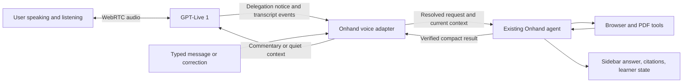

# Onhand voice migration: GPT-Realtime 2.1 to GPT-Live 1

Prepared September 13, 2026 against `main` at `9f8afa1`, then updated during implementation. The source map below describes the pre-migration baseline; line numbers there are historical.

## Early correction experiment (September 16, 2026)

Managed GPT-Live + Terra remains the research path. The new `liveInterruptionEnabled` setting defaults off; it was enabled in the local Helium installation for the voice trial after rebuilding and reloading the unpacked extension. A separate, tool-free GPT-5.6 Luna request classifies the resolved active question and accumulating new speech. It receives no PDF/page dump, uses `store: false` and strict structured output, and can return incomplete correction (`pause`), actionable correction (`revise`), acknowledgment, explicit resume, unrelated question, or uncertain. This follows [React to transcript fragments](https://developers.openai.com/api/docs/guides/live-delegation#react-to-transcript-fragments) and the concurrent checks in [Live conversation guardrails](https://developers.openai.com/api/docs/guides/voice-server-controls?api=live#apply-conversation-guardrails).

An evident correction pauses the next Onhand tool, draft publication, grounding-repair continuation, and `response.create`. A running tool finishes and returns its actual receipt. A fixed application-authored instruction asks Live to listen and avoid the old answer. An incomplete correction keeps the task paused. Once the meaning is actionable, old queued actions receive not-run receipts, then Onhand appends the original request and correction as user data with `response.item.create` and explicitly continues the same managed conversation. The next response is constrained to `onhand_get_context`, which resolves the complete revised request; normal tool choice is restored afterward. This preserves requirements not revoked, the same saved question, and completed evidence. It does not need Live to emit another delegation. If a fresh managed delegation already arrived during the pause, the existing reconciliation handles that successor instead. Acknowledgments and unrelated questions alone do not pause work. An acknowledgment does not clear a confirmed pause; an explicit withdrawal or **Resume page work** does. There is no keyword-specific rule for the Transformer example and no silence timer that resumes an incomplete correction.

Checks are debounced 250 ms, at least 750 ms apart, with one concurrent request, a five-second fetch timeout and at most 48 checks per call. Context is bounded to 4,000 question characters and 3,000 accumulated speech characters, without silently truncating either. Oversize context, missing resolved question, late original captions, exhausted budget, timeout, or failed checks do not manufacture a correction; existing managed processing remains available. A timeout/failure cannot release an already-confirmed pause. New transcript versions, retired tasks and End invalidate late decisions. These conservative guards can miss a correction or increase detection delay, which the real trial must measure.

Local **Voice transcript → Timing diagnostics** records arrival times, caption offsets/lengths, delegation and request/revision IDs, classifier decisions, tool boundaries, continuation, steering acknowledgment, and microphone/output-audio activity. Copy exports only this metadata, not prompt/page/transcript text or keys. The latest 500 events are saved with the existing local transcript record. Audio activity is an analyser estimate, not proof of exactly what was heard; steering acknowledgment only proves instruction receipt. Correction-check token usage is shown separately from managed backend usage; failed/timed-out provider work may not return usage. No new diagnostic upload is added.

This is an application tool/continuation gate, **not cancellation of an in-flight hosted inference or a guaranteed pre-speech filter**. Managed results can reach Live before client review. Pausing also cannot undo a completed highlight or note. A complete correction can continue only after current inference and tool receipts settle. The partial-correction case still waits for meaningful new speech, explicit resume, or End. A new fragment invalidates a correction decision that has not yet been submitted. A continuation awaiting `response.created` is treated as in flight, preventing a second inference during that registration gap.

The first real trial exposed a deadlock in the earlier design. The correction was transcribed, page work paused at 21,398 ms, Live acknowledged steering at 22,068 ms, and the running tool returned at 25,450 ms. No new delegation followed: Onhand was waiting for a delegation while withholding the backend continuation. The visible transcript contained the complete correction, "Actually, only English to German and BLEU points, not percentages." The call was ended to stop waiting; its last displayed duration was 179 seconds, with final voice usage unconfirmed. Those timings come from visible diagnostics, not a complete exported event log. The in-place continuation above fixes that dependency; the later exported trial below confirms provider acceptance and exposes a separate duplicate-delegation failure.

Automated validation covers the opt-out path, acknowledgments, unrelated questions, explicit/manual resume, a correction during an action or answer review, invalid/stale decisions, duplicate/delayed captions, bounded checks, timeout/failure, End, complete action receipts, revised request identity, background setting/session guards, sidebar recovery and local timing export. The deadlock fix adds cases with no new delegation, partial-to-complete speech, new fragments invalidating a ready correction, and correction during the response-registration gap. The sidebar integration also exercises automatic recovery without pressing Resume. Browser-runtime fixtures require permission to bind localhost. The new setting is visibly saved with managed Terra still selected; configuration and mocked transport checks are not proof of a successful spoken interruption.

The deadlock-recovery build passed 45 managed protocol/supervision checks plus the existing client/caption checks, sidebar regressions, extension build, preflight, syntax, and diff whitespace checks. It was reloaded through the extension manager; the updated options help text, enabled correction setting, managed Responses, and Terra selection were visible afterward. The original PDF renderer became blank during browser inspection/reload; a fresh native-PDF tab loaded the same paper, and the blank tab was closed. Onhand reopened with its saved session and Voice idle before the next user-run trial.

### Delayed delegation replay after a successful correction

The user's exported September 16 12:18 PM trial confirms that the correction worked inside the original managed task: actionable revision at 21,321 ms, correction submitted at 26,733 ms, revised context resolved at 28,506 ms, and successful task completion at 52,383 ms after research, highlights, notes and answer review. No user transcript arrived after 17,619 ms. At 52,870 ms, however, Live created a second delegation whose audio offset was 14,800 ms, inside the already-consumed correction interval of 11,400–15,000 ms. At 54,955 ms its context call classified the request as `continue`. Onhand rebased it to revision 2, cleared the completed answer and ran more work. The coordinator closed at 64,110 ms and persisted that duplicate revision as interrupted. This is an unintended replay, not a grounding retry. The metadata establishes ordering and identity; it contains neither answer text nor exact audible playback.

The first replay guard retained an applied correction's audio range and caption cursor once the forced context call resolved. A later backend-classified continuation pointing into that range, with no further unconsumed speech, was retired before any runtime begin/update/finish. Its function calls received explicit already-applied/not-run receipts; it did not start another inference, redirect the correct spoken answer, clear saved text or repeat page actions. Future requests skipped that retired duplicate when resolving their predecessor. Independent requests, later or missing offsets, late/new speech and corrections not yet resolved retained the normal path. The later-offset assumption was incorrect and is superseded by the follow-up below. Diagnostics included applied correction ranges and `duplicate_correction_delegation`, without speech or page content.

Validation reproduces the exported ordering (failed before the guard, passed after), a duplicate during ongoing research, complete duplicate tool batches, End after a duplicate, fresh follow-ups retaining the correct revision identity, independent requests, missing/later offsets, late captions and a submitted-but-unresolved correction. The sidebar integration confirms no duplicate begin/update/finish and persistence of the timing event. All 69 Live checks (20 client/caption and 49 managed), sidebar regressions, extension build, preflight, syntax and whitespace checks pass. Computer Use reloaded the unpacked Onhand extension in Helium with the visible `Reloaded` confirmation, then reopened the sidebar on the same PDF with Voice idle. This duplicate guard has not yet passed a new real spoken trial; managed delivery still does not provide an application-enforced pre-speech filter.

#### Delegation offset outside the caption span (4:18 PM trial)

The train trial completed its corrected task at 94,427 ms and suppressed the delayed continuation at 97,911 ms. Its spoken transcript contained only `[hum]` after the correction; that run did not establish complete spoken delivery. Noise/network effects were plausible but not measured.

The subsequent 4:18 PM exported log establishes another replay: correction audio 12,400–16,800 ms, submitted at 23,710 ms, resolved at 27,034 ms, and successful completion at 50,334 ms. A new delegation arrived at 50,913 ms with `offset_ms: 18200`, classified `continue` at 52,664 ms, and became revision 2. It reread context, scrolled, reviewed and generated another answer, finishing at 62,970 ms. No new user transcript or microphone activity followed the correction before the replay. The prior guard incorrectly required `offset_ms < correction.end_ms`, so it missed this case. This was not a grounding repair or an intended fresh user request.

The [Live event reference](https://developers.openai.com/api/reference/resources/live/sideband-websocket#session.delegation.created) defines `offset_ms` as the delegation position on the session timeline, not a bound on the user's speech. The guard now has no upper time cutoff. It requires a resolved applied correction, backend `continue`, a finite offset no earlier than the correction, a valid predecessor, and no subsequent unconsumed captions, typed input, or microphone activity. Input activity is versioned separately so genuine speech awaiting its transcript is not discarded; assistant output activity does not count. Noise after a correction can conservatively prevent suppression, so this remains an experimental heuristic rather than an authoritative provider turn ID. `correction_replay_checked` records the matching result and input-change metadata without text.

The regression reproduces a completed answer followed by a continuation at 18,200 ms, also testing the exact caption-end boundary and a much later delegation. The old guard failed the new test; the patched guard preserves the original answer, avoids another inference/steering instruction, settles duplicate calls, and keeps End from overwriting success. Separate cases preserve independent requests, missing/earlier offsets, late captions, untranscribed or ongoing microphone input, and typed follow-ups. Sidebar integration now uses an offset after the correction's caption end. All 70 Live checks (20 client/caption and 50 managed), sidebar regressions, build, preflight, syntax and whitespace checks pass. Computer Use verified that the user's call had ended, closed the panel, reloaded Onhand from a fresh extension-manager tab with a visible `Reloaded` confirmation, and reopened the existing PDF's panel. The single saved answer, training cost, BLEU comparison and final 209-second voice usage remained visible; Voice was idle. A new real spoken trial is still needed to establish end-to-end audio behavior.

#### Subsequent user-run spoken trials

The September 16 4:30 PM screenshot showed a complete written comparison, including training cost, while the visible spoken transcript ended with “I'm waiting on the training cost numbers.” The snapshot alone does not establish whether speech continued afterward. In the 4:34 PM retry, the user explicitly reported a complete verbal response. Its transcript included Base 27.3 versus Big 28.4, the 1.1 BLEU-point gain, and about seven times the training FLOPs, matching the written result and retaining the original cost requirement. The screenshot showed one completed turn and a 59-second usage snapshot while Voice was ending; this was not confirmed final usage.

The latter is a successful real spoken trial. Neither trial included an exported timing log, so these screenshots do not establish whether the replay guard fired or no duplicate delegation occurred. Repeatability, including complete delivery after a suppressed duplicate, remains to be verified before enabling the experiment by default.

Trial: start Voice on the PDF and ask to compare base and big in Table 2, including training cost. After Live acknowledges, revise the language and units while source work is active. Confirm the UI pauses further actions, listen for old-answer leakage, confirm the revised answer retains cost, then End and inspect/copy timing diagnostics. In separate work, say “okay”/“mm-hmm” and confirm actions continue. If a correction pauses incorrectly, use Resume page work. Repeat with a different HTML source before enabling by default.

## Managed answer grounding (September 16, 2026)

### Fresh conversation evidence and follow-up

The user's 10:25–10:27 AM real call completed three expected turns without the earlier managed-operation error or phantom card. The Figure 1 answer had two highlights, two notes and inline citations; the corrected English-to-German comparison was saved once and correctly reported 28.4 minus 27.3 as 1.1 BLEU points. The last request quoted Section 3.5 and reused citation [2]. The supplied browser inventory showed one tab for this PDF. The call ended at 190 seconds with about $0.16 voice usage and 747,714 backend input / 3,193 output tokens. Backend input is summed once per completed response, so repeated context contributes to that total; the voice estimate excludes backend cost and the display does not expose cached-token billing.

Two remaining problems were visible in that call. The revised comparison omitted the initial training-cost request even though the correction only narrowed the language and changed the requested units. Live and backend reconciliation instructions now explicitly retain requirements that were not canceled or replaced; the later spoken retest below retained training cost. The last quote was longer than its visible highlight. Inspection found that both PDF annotation implementations accepted a shorter existing mark contained inside a longer requested quote. Reuse now requires coverage of the entire requested text, and an old anchor cannot supply partial geometry for an expanded quote. Exact duplicate cleanup also preserves distinct overlapping source marks and their notes. Older citations stay valid; asking for a longer quote can create a separate complete mark.

The activity summary previously counted every annotation action, including scrolling to existing marks, as a new highlight. It now distinguishes distinct new highlights from reused sources and carries reuse metadata from highlight results. This explains how a turn could report four highlighted passages while adding only two page marks. Automated checks exercise whole-quote reuse on different source texts, stale anchors, repeat replay, retained overlapping notes, and the rendered activity summary. The later call below used the reloaded build but did not exercise every case. The raw `$N$` in one marginal note and the large cumulative backend usage remain quality/performance observations, not claimed fixes.

Follow-up validation passed: extension build, page-toolkit, sidebar, Live (20 client/caption plus 28 managed checks), browser-runtime, preflight, JavaScript syntax and diff whitespace. The page-toolkit suite's older Google Docs source assertion was updated to the already-implemented native-PDF tab-reuse expression; production handoff tests separately preserve Docs behavior. The browser-runtime suite required its local fixture server to run outside the filesystem sandbox. The browser connector could list the existing PDF and Extensions tabs but reported that the internal Extensions tab cannot be claimed, so a manual reload was requested before further live validation.

The user then confirmed the reload. Native UI inspection found the original PDF tab, an empty Onhand session and Voice idle. Attempts to activate Voice through accessibility and keyboard did not change that state; a coordinate click returned `noWindowsAvailable`. No live call or new source actions were observed from those attempts. The user subsequently ran the comparison plus spoken correction themselves.

### Correction semantics pass; correction timing fails

The supplied 10:44 AM snapshot and user report establish a 96-second call with about $0.08 voice usage and 279,561 backend input / 1,972 output tokens. The user first requested the Table 2 quality and training-cost comparison, then narrowed it to English-to-German and BLEU points while the backend was working. The final saved turn retained training cost and correctly gave 27.3 versus 28.4 BLEU, a 1.1-point gain, and 3.3 × 10^18 versus 2.3 × 10^19 FLOPs, approximately seven times the compute. Citations, three highlights and one note were visible. This validates requirement retention in this call.

The user reports that the first answer appeared and began speaking before the earlier correction took effect; speech then cut off and the revised answer replaced it. The visible transcript includes the corresponding joined fragment, “Transformer big improves English-to-German BLEUFor English-to-German...”. This is an unresolved interruption-timing failure. One revised turn is the intended storage model, but publishing and speaking the older answer before applying an already-spoken correction is not the intended interaction. Raw event-arrival timestamps were not captured, so the exact share of delay attributable to transcription, Live delegation, backend inference and application processing is unknown.

Code inspection confirms a vulnerable ordering: `live-responses.js` does not supersede the earlier task until a completed `onhand_get_context` function item classifies the new request as `continue`. User captions alone do not change task identity. Managed Responses also delivers backend output directly to Live, so application finalization cannot guarantee suppression of an older spoken result. The [Live delegation guide](https://developers.openai.com/api/docs/guides/live-delegation) documents that spoken interruption does not automatically cancel backend work and distinguishes direct managed delivery from application-owned result review. Sending a late corrective instruction can redirect speech; it cannot retract audio the user has already heard.

The next structural change should process request revisions independently of the long-running evidence task, preserve unrevoked requirements and verified evidence, and gate final result delivery on the current revision. Strict application-owned filtering of backend results fits client delegation; any migration must preserve the selected voice/backend models and the existing tools, grounding and persistence behavior. It is not sufficient to strengthen the prompt or claim that an append acknowledgment proves playback. The [playback-control guide](https://developers.openai.com/api/docs/guides/voice-server-controls?api=live#control-playback-when-needed) also cautions that client result review alone does not approve every word Live speaks; media suppression requires its own tested recovery policy. No mode switch or timing fix was made during this diagnosis.

Acceptance must include a delayed original backend response, a correction arriving during source work, the old response finishing after that correction, and a single revised spoken answer retaining training cost. Also test an independent follow-up, a backchannel that must not cancel work, multiple corrections and already-completed source actions. Measure event arrival and actual audible output separately. Two additional visible issues remain unverified: the source rail retains both a partial base-row highlight and a full one, and the inline viewer is on page 6 rather than Table 2 on page 8 after completion.

The 72-second Figure 1/word-order test below passed voice persistence and PDF tab reuse, but failed the grounding contract: only two page images were captured, with no supporting text read, highlights, notes, or inline citations. The normal finalize retries required `activeAgent`, which managed Responses never creates. Figure-plus-mechanism questions also fell through the narrow source-marker eligibility check.

Managed Responses now exposes `onhand_review_answer` to check a draft before final prose. The runtime uses verified actions and the existing source-marker eligibility/count checks, includes completed work from a continued request, and requires a text read for conceptual PDF answers based only on images. Conceptual/teaching answers need a supporting mark and interpretive note; returned citation IDs must resolve to created or tool-verified reused marks. Current-turn marks must be cited. Pure visual descriptions and no-page-changes requests keep their exceptions.

The coordinator rechecks terminal prose even if the backend skips the review tool. Missing grounding can trigger at most two automatic repair passes in the same Responses context, replacing the rejected sidebar draft while retaining completed tools. End, corrections, source-history limits and exhausted review attempts block more repairs. Runtime finalization records incomplete grounding as an explicit error rather than silently accepting it. The model is still responsible for choosing genuinely relevant passages: these structural checks do not prove semantic entailment.

This is not a hard pre-speech gate. Managed Responses can deliver text to Live before the client receives the final event; the draft-review tool is instructed before prose, and fallback repair appends a speech-redirection instruction, but already-spoken audio cannot be retracted. The existing client backend remains the option for strict application-owned delivery. Continuation uses the documented `response.item.create` plus `response.create` flow in the [Live delegation guide](https://developers.openai.com/api/docs/guides/live-delegation).

Automated validation covers conceptual PDF requests across different subjects, HTML teaching, quick visuals, no-page-changes, missing/failed notes, invalid citations, verified anchor reuse, continued-request evidence, finalization failure, bounded repairs, End and corrections during review, and source-budget pause. Build, Live, sidebar, browser-runtime, agent-runtime modules, preflight and whitespace checks pass. The first real follow-up reached eight source steps, read page 6, placed two highlights and one note, then failed after prose with `Unsupported managed voice operation.` This confirms improved source work but does not establish a successful finalized/cited answer. The current source and generated runtime both support the final `review` operation, and the regression now executes the actual background message branch into the bundled runtime successfully. The observed error points to a fresh sidebar paired with an older loaded worker; that loaded-worker mismatch is an inference, not a captured worker-version diagnostic.

Managed startup now requests the existing runtime config and verifies the `onhand_review_answer` capability before microphone acquisition or a paid session. An older runtime gets a specific close-panel/reload-extension/reopen instruction instead of a late failed turn. Sidebar regression covers this mismatched pair and confirms that no mic, session, or turn starts. The successful real retest is recorded above; it does not establish every spoken interruption or model tool choice.

## Overlapping captions and PDF tab reuse (September 16, 2026)

The user's real Figure 1 test produced the full combined question and a grounded answer with three highlights and three notes. It also exposed a false direct-voice card: the transcript labelled "the diagram depicts" as user input, then the journal attached the tail of Live's spoken explanation to that fragment. The visible transcript establishes the input label, not whether the audio originated in microphone echo, background speech or transcription error. It does not expose raw caption offsets, so the precise interval sequence in this call remains unverified.

The display journal now joins touching/overlapping assistant audio intervals before pairing speakers. A user fragment cannot reparent the tail of the same continuous output. Input entirely inside uninterrupted output stays in the raw transcript; output that began during input is not saved as its answer. Later independent questions and interruptions followed by a separate answer remain saveable. Late captions can retract a provisional card. No speech detector settings, microphone muting, delegation rules, or model calls were added. This remains a conservative caption projection, not authoritative speaker/turn detection: misrecognized input outside overlapping intervals can still be ambiguous. Revisable captions no longer set a permanent session name; the authoritative question supplies it when available, preserving manual names.

The first PDF handoff now reuses a target tab already showing the requested PDF, even with `newTab: true`. URL-only opens look for that PDF in the originating window before allocating a tab, preferring the active matching PDF. Page detection and selection handoff run against that existing tab. Different PDFs still open separately, Google Docs exports preserve the document, and local-file permission checks remain in force. This covers managed Live's first-open path, which does not run the normal agent's automatic PDF preflight.

New mocked regressions reproduce the caption-tail error, late caption retraction and direct follow-ups, and execute the production PDF command/handoff branches against controlled Chrome tabs. Extension build, 20 client/caption and 24 managed Live checks, sidebar and browser-runtime suites, preflight, background syntax and diff whitespace checks pass. The earlier saved test is retained unchanged.

After reloading, the user repeated the full Figure 1/word-order question, then asked "Repeat just the word order point." The real call ended normally after 72 seconds. The sidebar showed exactly two expected turns: the backend answer (three tool steps and two image sources, but no highlights or inline citations) and a complete direct **Voice answer** for the repeat request. The title came from the original question, and no phantom exchange appeared in this test. The browser tab inventory confirmed that the original native-PDF tab ID `1235323443` was retained, now hosting the inline Onhand viewer at page 3; no second tab for this PDF remained. This validates this speech/follow-up/handoff workflow, not every possible overlapping-caption or microphone-echo sequence. The earlier misrecognized phrase was not deliberately reproduced in the acoustic test.

## Spoken continuations (September 16, 2026)

Live's short frontend prompt now asks it to keep listening during thinking pauses, yield when the reader resumes, and convey the complete updated request. No endpoint timer or voice-engine setting changed. This follows the [Live prompting guidance](https://developers.openai.com/api/docs/guides/live-prompting).

Managed Responses uses its existing reasoning model and `onhand_get_context` call to classify each delegated request as a distinct question or a continuation/correction. The tool's `full_request` carries the complete intended question. This adds no separate classifier model or inference request; the existing context call has two extra arguments. Raw captions and pause lengths never trigger cancellation or merging. Missing or invalid relationship metadata leaves the request independent.

A semantic continuation reuses the logical Onhand request ID with an increasing revision scoped to the voice call. The updated question replaces the earlier saved turn, retaining completed source actions, citations and tool records. Completed in-flight tools return their actual results; older actions that have not started receive explicit not-run results. The superseded loop is not continued. Revision guards reject stale updates, and late calls from a finished delegation cannot execute or reopen the turn. Multiple pending corrections can be classified out of order and still resolve to the latest revision. Ending before completion saves an interrupted state instead of a misleading empty-answer success.

Managed Responses remains selected and its results still reach Live directly. Onhand appends a short instruction to redirect speech after a continuation is identified, but this cannot retract speech already heard or guarantee silence before classification. This implementation does not cancel an in-flight managed inference. [OpenAI's delegation guide](https://developers.openai.com/api/docs/guides/live-delegation#keep-updates-accurate-and-useful) assigns task revision and stale-result handling to the application; its distinction between managed and client result delivery still applies. An edit-and-retry UI is outside this change.

The extension build, Live protocol regressions, sidebar regressions, browser-runtime regressions, preflight and diff whitespace check pass. Automated coverage includes distinct follow-ups, continuation during source work, successive out-of-order corrections, delayed sidebar state polls, late captions and old results, End during preparation, revision persistence/restart, retained annotations, and keeping the sidebar to one logical question. Reloading the unpacked extension and evaluating real spoken pauses, interruption timing and saved history are still pending; mocked event tests cannot establish conversational quality.

## Direct spoken-answer persistence (September 15, 2026)

The Transformer PDF test exposed a missing save path: a simple follow-up answered directly by Live appeared only in the Voice transcript. New direct spoken exchanges now also become normal saved conversation turns labelled **Voice answer**, in both managed and client modes. Saving captions makes no model request and does not change delegation decisions. These turns enter conversation history and session exports; they do not inherit citations or page actions from an earlier backend answer.

Caption grouping uses audio offsets and remains revisable, following [Live transcript guidance](https://developers.openai.com/api/docs/guides/live-conversations#transcript-deltas). Streaming fragments update an existing card; a late delegation notice retracts its caption-derived card so the delegated answer remains authoritative. Raw deltas remain in the separate transcript. Overlapping speech can make exchange boundaries ambiguous; this display grouping never triggers tools or cancels work. End flushes final captions before resolving. The save operation is scoped to the original Onhand session and call, with durable revision ordering, and preserves the backend execution lane.

Automated protocol, sidebar and runtime checks cover direct follow-ups, reordered/duplicate fragments, late delegation, typed-request suppression, overlapping backchannels, final captions during End, session changes, reopening, and runtime restart. Build and preflight pass. A real spoken test after reloading this build is still pending. Older transcript-only replies are retained in their original disclosure, not automatically reconstructed as new turns without delegation metadata.

## Managed Responses implementation (September 14, 2026)

Live now defaults to **managed Responses delegation** when selected, with GPT-5.6 Terra as its independent reasoning model. GPT-5.6 Luna and the previous **Onhand agent (client fallback)** are available in options. Realtime remains the overall default voice engine. The user's text model and authentication settings are preserved; managed reasoning is billed to the saved OpenAI platform key.

Current follow-up: the user's ordinary OpenStax/Wikipedia Tacoma Narrows fact-check exhausted the first input-budget guard after six tool steps, before answering. The earlier PDF pass was insufficient evidence for research readiness. The corrective build now sends tool results larger than 1,500 encoded bytes as expiring text-file references, retaining the entire result returned by the tool instead of cutting it to a leading excerpt. The files carry existing source URLs, quotes, annotation IDs and extraction-limit notices. Identical results reuse one uploaded/attached file within the call. Existing tool extraction limits still apply; this does not assert that every source page was read in full.

At 24,000 event-history bytes or 100 appended items, new source actions pause: pending functions receive explicit not-run results, backend tool choice changes to `none`, and the backend finishes from existing evidence while the voice connection stays open. This preserves space to deliver the answer and avoids the previous abrupt stop. Learning-mode changes cannot silently re-enable paused tools. A much longer call can still require a restart for fresh source work; the managed API's history ceiling remains finite.

The new build passes 14 client / 18 managed protocol checks, sidebar regressions, browser-runtime regressions, build and preflight. New coverage includes eighteen large distinct sources with decisive evidence at their ends, UTF-8 file fidelity/expiry, duplicate upload suppression, delivery failure, Stop during source upload, and completing an answer with tools paused. File input behavior follows [Responses file inputs](https://developers.openai.com/api/docs/guides/file-inputs).

After the user reloaded and started Voice, the real managed call completed the original Tacoma Narrows question in five visible tool steps, using the OpenStax passage and Wikipedia evidence. It returned the aeroelastic-flutter correction with citations [1]-[3], two new Wikipedia highlights, a note and a saved artifact. The connection stayed open. A second request in the same call cross-checked Washington State DOT's account in five further steps and returned its primary torsional-flutter explanation plus its qualification about disputed details, with citations [4]-[5], two highlights, a note and another artifact. No source-history or file-input error occurred. These results establish that the source-file build works through the real managed API on this research workflow; they are not a measurement of the remaining event-history capacity.

Clicking citation [4] opened the correct WSDOT tab and scrolled to the highlighted passage, which was verified visually. End received confirmed final usage of **93 seconds**, about **$0.08 voice**, plus **295,844 backend input / 1,197 output tokens** cumulatively across both tool loops. Closing and reopening the panel on OpenStax restored both completed answers, citations and final usage alongside the original failed turn. File references reduce transport-history bytes; they do not eliminate backend context tokens or their cost. The call is ended. This check used typed requests with the microphone muted; spoken interruption and audio quality were not assessed. The near-limit pause behavior is covered by automated tests, not by deliberately exhausting this real call.

- Live supplies backend conversation context, initiates delegated Responses work, and receives its results directly. Onhand no longer reconstructs a model request from captions or reduces the backend answer to a short commentary append in this mode.
- The managed backend receives Onhand's constitution, source/annotation contract, teaching instructions, recent conversation and learner state. `onhand_get_context` refreshes page/selection and learner context for each new request. Browser, PDF, visual, artifact and learning tools execute directly through the existing runtime registry, validation and request guards. No Pi agent or internal reasoning model is started by this bridge.
- Nested Responses events are collected per response and delegation. Completed function items are tracked independently of empty terminal output snapshots. All required function results are returned before an explicit `response.create`; duplicate calls are memoized, and unrelated Onhand work retains its execution lane.
- Backend text streams into the sidebar, and completed turns use the normal source-action, citation, learner-state and session persistence machinery. Spoken captions remain a separate record. Backend token usage is counted per completed response and stored alongside cumulative voice duration.
- Typed messages and image/text attachments enter the managed Responses conversation. Images and large text results use OpenAI Files API references, with a one-hour server expiration, so content bytes do not consume Live's small input-history budget. Duplicate images and text results reuse files within a call. Corrections received during tool work are queued until pending results are returned. They do not cancel an in-flight inference or undo an action. Live handles conversational corrections; the application executes tools serially.
- Stop and End close the managed voice session, silence local playback and block subsequent tool calls. An already executed action is not undone. A scoped abort and finalization release the Onhand lane; late events cannot release a different request. Final voice usage is confirmed only by `session.closed`, with a five-second transport cleanup timeout. There is no undocumented `response.cancel` command.
- In managed mode, results can reach Live before Onhand's final persistence/citation normalization. This mode does not provide a pre-speech result review gate. The client fallback retains that control and other-provider routing.

Automated validation: managed protocol tests cover empty terminal snapshots, multi-call continuation order, duplicates, typed/image correction queuing, closing during tools/preparation, unrelated work, usage, settings changes and command errors. Runtime regressions cover shared tools, schema validation, disabled tools, learner persistence, citation actions, restart recovery and request ownership. Sidebar regressions cover direct tool dispatch, streaming, saved turns and backend usage. After the user reloaded the managed build, a real call connected and recorded Responses token usage. A question on the Live prompting guide reused an existing highlight and returned a clickable citation. A second request opened W3C's one-page dummy PDF, opened the Onhand viewer, read page 1, highlighted “Dummy PDF file,” and saved a cited answer and artifact. These confirm managed browser/PDF tool dispatch and continuation in a real call.

A subsequent PDF-image request completed the capture tool but the call then failed. The original shutdown path cleared the error and saved an empty reply; final voice usage was unconfirmed (last snapshot 104 seconds, 225,621 backend input tokens and 497 output tokens). After adding error preservation and reloading, a fresh real call exposed the service error: backend response input history is limited to 128 items and 32768 UTF-8 bytes per session. Inline image input exceeded that allowance. The failed call ended, with a last snapshot of 59 seconds and 109,434 input / 428 output backend tokens; final voice usage remained unconfirmed.

The first corrective build used expiring file references for images and explicit image-upload errors. It cut tool output above 6000 encoded bytes to a leading excerpt and stopped before further actions near a 30,000-byte / 120-item session budget. The user's subsequent research failure showed that this strategy was too restrictive and could discard relevant later evidence; the current follow-up above supersedes it. Error replies no longer acquire fallback citations from unrelated earlier highlights.

All 14 client and 14 managed protocol regressions, sidebar regressions, build and preflight pass on the corrective build. Tests include large images, upload expiration and deduplication, upload failure, Stop during upload, a correction before response registration, UTF-8/JSON output accounting and stopping before a browser action when the budget is exhausted.

After the user reloaded the corrective build and reopened the panel, a real managed call passed the PDF-image path. While it was opening the PDF, a typed correction requested the text's position and weight. The saved turn included both prompts, identified “Dummy PDF file” near the upper-left in bold black type, reused citation [6], and recorded five steps with two recovered source-scroll retries and no new highlight. Independent visual inspection matched the layout and wording; the answer put an extra sentence period inside the quote, so character-perfect transcription is not established. The earlier input-history error did not recur.

End received confirmed final usage of **85 seconds** (about **$0.07 voice**, plus **160,988 backend input / 745 output tokens** across the tool loop). Closing and reopening the side panel restored the seven turns, combined correction, cited answer and final usage. The call is ended and Live remains selected. This proves managed image input, an in-flight typed correction, graceful closure and saved-state restoration. Spoken interruptions/audio quality, live learning interactions, and broader equation/chart/long-PDF acceptance remain unverified; automated learning persistence tests pass. Keep the engine experimental and do not infer these remaining results from the older client-mode evidence.

Sources: [Live delegation and tools](https://developers.openai.com/api/docs/guides/live-delegation), [Live session management](https://developers.openai.com/api/docs/guides/live-conversations).

## Previous client implementation and validation

The local extension now includes an opt-in **GPT-Live 1 (experimental)** voice engine. Realtime remains the default for existing and new settings. Choosing Live preserves the configured text/vision provider and routes delegated work through Onhand's normal browser runtime.

Implemented:

- WebRTC session creation in the extension worker using the existing user-provided OpenAI key, client delegation, `marin`, and `store: false`. The sidebar becomes ready only after `session.started`.
- Separate Live event handling, input/output caption streams, typed corrections and attachments, session-scoped request IDs, duplicate-notice handling, and suppression of stale spoken results. Delegation notices can wait for late captions; old notices cannot claim future speech.
- The single backend lane is preserved. A new Live request supersedes earlier voice-owned work and waits for its finalization; a request owned by another client is allowed to finish. Independent Live requests are not classified into a separate queue yet.
- Source reading, highlights, citations, PDF/vision handling, and Learning Mode remain in the existing agent. It is asked to lead with a concise, complete paragraph for speech. Long opening paragraphs fall back to a sidebar notice instead of being cut mid-sentence.
- Local microphone muting plus server acknowledgment, cancellation during microphone startup, graceful End with a five-second finalization timeout, cumulative voice-duration snapshots, and local transcript checkpoints. Ending Voice preserves running backend work in the sidebar and suppresses further speech. Stop cancels the scoped backend request.
- Continuous captions are stored separately under the Onhand session in local extension storage, avoiding mutations to the runtime's active request. They reopen in the Voice transcript disclosure and are removed with that session. They are not currently part of the regular session export. Voice duration displayed is for the latest call; backend costs remain separate. Browser-owned panel closure and transport loss can leave final usage unconfirmed.

Validation passed locally:

```text
npm run build:extension
npm run test:live-voice-regressions       # 14 checks
npm run test:sidebar-regressions          # includes mocked Live transport and microphone races
npm run test:browser-runtime-regressions  # includes session isolation and scoped preparation cancellation
npm run test:agent-runtime-modules
npm run test:preflight
git diff --check
```

After the user reloaded the final build, a real WebRTC call connected using the saved key and reached **Live · listening**. Two typed requests went through the Live adapter and the normal backend:

- A question about interruptions returned a grounded answer and highlighted the exact supporting sentence, with a clickable citation.
- A comparison with the linked delegation guide completed with four new highlights, two notes, citations, and a saved artifact. It retained the existing backend provider.

The Live output transcript included the returned answer. End completed with confirmed final usage of **246 seconds**, and reopening the side panel restored the two backend turns and the voice transcript/usage disclosure. The call is ended; Live remains selected in this user's options.

Actual audio quality, spoken delegation/correction timing, and the diverse HTML/PDF/vision/learning acceptance matrix remain unverified. Browser-control interruptions prevented submitting the intended correction while the second request was active; scoped correction behavior is covered by automated tests, not claimed as a real-call pass. The output transcript also showed GPT-Live repeating a typed question before answering, so typed-context presentation needs conversational evaluation. Do not promote the default until these remaining checks pass.

## Original recommendation (superseded by managed Responses above)

Use `gpt-live-1` over WebRTC with **client delegation** to Onhand's existing browser runtime and Pi agent. Keep the user's configured reasoning provider/model. Introduce Live behind an experimental voice-engine preference, compare it with Realtime, and change the default only after acceptance.

The main benefit is more fluid conversation while page work proceeds. Improved reasoning, grounding, or learning continuity would come from the retained backend and adapter work, rather than from a voice-model swap alone.

OpenAI recommends client delegation for applications that already operate a text agent and need to own its context, execution, and result validation. Managed Responses delegation is also available, but would add a second orchestration path around functionality Onhand already has. [Migration guidance](https://developers.openai.com/api/docs/guides/live-migration), [delegation comparison](https://developers.openai.com/api/docs/guides/live-delegation#choose-a-delegation-mode).

## Current implementation

Source is authoritative where older voice design documents disagree with it.

| Responsibility | Current code and behavior |
| --- | --- |
| Voice model and setup | `packages/browser-extension/background.js:22` selects `gpt-realtime-2.1`; `buildRealtimeSessionConfig` at line 14089 configures audio and semantic VAD. |
| Credentials and transport | Background creates a multipart request to `/v1/realtime/calls`. `sidebar.js:8052` also has an ephemeral-secret fallback and the local development server path. |
| Browser audio | `sidebar.js:9806` owns microphone access, `RTCPeerConnection`, the `oai-events` channel, and remote audio playback. |
| Main voice routing | `sidebar.js:8129` routes most page-material prompts through the regular agent; explicit Socratic requests in Learning Mode and calendar-pattern requests take the Realtime route. |
| Agent bridge | `startRealtimeDirectAnswer` at `sidebar.js:9158` uses `sidebar:submit-prompt`; `maybeSpeakCompletedRealtimeDirectAnswer` at line 9195 narrates the settled answer. |
| Separate voice agent | `realtimeTutorInstructions` at `sidebar.js:7939` defines an independent tool-using tutor and explicitly forbids delegation. That prompt cannot be copied into Live. |
| Request concurrency | `browser-runtime.ts:15663` rejects a new submission while a request, agent, or session transition is active. `stop()` at line 15976 initiates abort; its return is not proof of finalization. |
| Persistence | `browser-runtime.ts:12374` saves paired voice turns. It also publishes `activeRequestId: null`, so it cannot simply be reused for continuous captions while another task runs. |
| Idle handling | `sidebar.js:21` sets a three-minute timeout; `stopRealtimeVoice` immediately tears down audio and the transport. Live needs explicit finalization. |
| Text model | The backend resolves the configured provider/model. GPT-5.5 is the Codex default, not a guarantee about the user's current settings. |

## What changes for users

| Area | Realtime 2.1 / today's Onhand | Proposed Live mode |
| --- | --- | --- |
| Conversation | Realtime handles speech, reasoning, and tool selection; Onhand already delegates many questions itself. Its voice flow waits for transcription and a local pause before submitting work. | Live continuously listens and speaks, manages conversational timing, and asks the application for backend help. |
| Interruptions | Realtime already supports interruptions. Onhand also cancels responses and clears output buffers locally. | Full-duplex conversation can accept corrections and brief interjections while speaking or awaiting results. Backend cancellation remains an application responsibility. |
| Long page work | Onhand schedules a delayed preamble and narrates the completed answer. | The user can continue a conversation while the same backend reads, searches, or annotates. This improves responsiveness without guaranteeing faster tool completion. |
| Tutoring | Explicit quiz requests have a separate voice-agent path. | Route teaching and evaluation through the regular learning backend; let Live manage the spoken exchange. Learning continuity must be implemented and tested. |
| Visual reasoning | Realtime 2.1 accepts images as well as audio/text. | Live's voice frontend accepts audio/text; route screenshots, equations, and figures to a vision-capable backend. |
| Speech fidelity | The current code tries to constrain narration to the published answer. | Live paraphrases supplied results. Preserve claims and citations, and verify that speech does not add unsupported material or reveal a quiz answer. |

The documented model distinction is continuous conversation plus delegated reasoning, rather than interruption support being exclusive to Live. [Live overview](https://developers.openai.com/api/docs/guides/live), [Realtime 2.1](https://developers.openai.com/api/docs/models/gpt-realtime-2.1), [visual inputs](https://developers.openai.com/api/docs/guides/live-delegation#add-images-and-visual-context).

## Target flow



“Backend” here means the existing extension agent and its model calls. Client delegation does not require moving the browser tools to an Onhand-hosted server.

## Implementation sequence

### 1. Add an isolated Live transport and verify access

Add a `voiceEngine` preference (`realtime` or `live`) independently of the text-model picker. Preserve the saved voice-enabled preference and platform-key configuration. Keep Realtime selectable during rollout.

Reuse mic selection, permission handling, echo cancellation, media tracks, and the data-channel wiring. Create a new Live session path; do not point the old multipart request at a different URL.

The documented request is `POST https://api.openai.com/v1/live/sessions` with JSON:

```json
{
  "session": {
    "model": "gpt-live-1",
    "instructions": "SHORT_ONHAND_CONVERSATION_PROMPT",
    "delegation": { "type": "client" },
    "audio": { "output": { "voice": "marin" } },
    "store": false
  },
  "transport": { "type": "webrtc", "sdp": "BROWSER_SDP_OFFER" }
}
```

Read `result.session.id` and `result.transport.sdp`. Register listeners before negotiation, wait for `session.started` before commands, and do not send `session.start` on the data channel. WebRTC carries audio on media tracks; omit explicit audio-format settings. [WebRTC procedure](https://developers.openai.com/api/docs/guides/voice-webrtc?api=live).

For the existing personal BYOK extension, first verify the new request from its background context with the user's platform key. This is an adaptation of the current architecture, not an officially documented extension-specific quickstart. The official web-app example creates sessions on a trusted server. Keep the platform key out of page scripts, data-channel events, and logs; never ship a shared product key in the extension. Update the local development broker as needed. Do not assume Live has the same ephemeral-key fallback as Realtime.

Exit check: a real Live session starts, produces audible speech, and closes with final usage using the intended credential path. Do this before a broad rewrite.

### 2. Build a transcript and task adapter

Maintain append-only input/output transcript streams with speaker, text, `start_ms`, `end_ms`, event identity, and session identity. Append deltas exactly as received; any caption grouping is a display heuristic, not a reliable user-turn boundary.

On `session.delegation.created`, preserve `event.delegation.id` and `offset_ms`. The event contains **no task text or function arguments**. Resolve the request using recent role-labelled transcripts, the active task, selected passage, page/tab identity, learning mode, prior answer, and open learning check. If a delegation arrives before usable transcript context, retain it and resolve it when more context arrives. Do not guess or drop it.

Track at least `(liveSessionId, onhandSessionId, delegationId, taskId, taskRevision, requestId, pageIdentity, status)`. Claim a delegation before starting work to prevent duplicate execution. Deduplicate equivalent requests across different delegation IDs without suppressing an intentional repeat.

Preserve the runtime's single active execution lane initially. Queue independent requests; for corrections, revise the task and either steer through a supported mechanism or abort and wait for actual request finalization before resubmitting. Recheck the revision before browser actions and before returning results. A casual listening acknowledgment must not cancel an active page task. [Client migration adapter](https://developers.openai.com/api/docs/guides/live-migration#connect-your-existing-agent).

### 3. Connect the existing answer and learning pipeline

Factor the reusable part of `startRealtimeDirectAnswer` into a provider-independent bridge. Preserve current page/PDF preparation, attachments, learning settings, session history, grounding rules, and validated page-action receipts.

Route Live's page explanations, quiz requests, and student answers through that bridge. Audit the old voice-tool inventory against the runtime tools so navigation, PDF search, highlights, notes, and source jumps remain available. Do not recreate the deleted historical planner/evaluator APIs just because older docs mention them.

Publish the full backend answer and citations in the sidebar. Return a compact result, at most 500 tokens per append, through `session.commentary.append`, with the original client `delegation_id`. Use `session.thinking.append` for relevant quiet progress and UI context. These are plain-string appends; the full structured results stay in Onhand. An append acknowledgment does not prove the user heard it. [Client result handling](https://developers.openai.com/api/docs/guides/live-delegation#receive-a-client-delegation).

Keep the canonical backend answer separate from the spoken transcript. Do not create a second saved answer for its narration or overwrite task status on every caption. Persist voice-only exchanges without clearing an active backend request. Typed input goes to the same adapter and task revision; mirror concise user data to Live as context, never as system instructions.

### 4. Replace turn controls and split the prompt

For Live only, retire Realtime audio commits, semantic-VAD configuration, `response.create` voice triggers, direct function-call handling, response replay queues, and `response.done`-based speech completion. Retain reusable local microphone diagnostics and controls. Live has no event marking the end of every spoken answer; derive speaking activity from playback/audio measurements, not backend completion. [Lifecycle mapping](https://developers.openai.com/api/docs/guides/live-migration#adapt-the-connection-and-audio-lifecycle).

Use a compact frontend prompt, for example:

```text
You are Onhand, a patient reading companion. Keep explanations concise and
conversational. Help the reader stay oriented to the passage they are studying.

Backchannel policy: Acknowledge occasionally and briefly while listening.
Interruption policy: Yield when the reader interjects and hear their correction.

Delegation policy:
Backend tools:
- Onhand can inspect relevant pages and PDFs, examine visual material through
  its configured model, locate evidence, add highlights and notes, and manage
  source-grounded explanations and learning checks.
Delegate to the backend when:
- The reader needs an explanation, source verification, page action, practice
  question, assessment of their answer, or a change to ongoing work.
Do not delegate to the backend when:
- A greeting, brief clarification, or repetition of a current verified result
  is enough.
Wait for evidence before making page-specific claims. Describe an annotation
as completed only after Onhand confirms it. Preserve uncertainty in results.
When coaching, speak the returned question without adding its solution.
```

Test this as a starting prompt, not a final guarantee. Put detailed grounding, browser permissions, teaching rules, and tool schemas in the backend. Refresh concise page/selection/mode context only when it changes. Use `session.instructions.append` for application-authored behavior changes, including mode switches; Live does not accept the old instruction-replacement `session.update` shape. [Prompt guidance](https://developers.openai.com/api/docs/guides/live-prompting), [session updates](https://developers.openai.com/api/docs/guides/live-conversations#update-a-live-session).

Keep speech interruption separate from task cancellation. A Stop-speaking control should control local playback and conversational guidance. “Cancel that lookup” must update task state and abort supported backend work. A prompt alone cannot guarantee that no unsupported audio is played before validation; if exact pre-playback enforcement is required, evaluate buffering or a stricter playback path and measure the latency tradeoff.

### 5. Finish lifecycle, billing, and recovery

Implement input mute/unmute acknowledgments alongside local microphone capture controls. Muting does not end billing or stop backend work. Send `session.close`, wait for `session.closed` with a bounded timeout, then release tracks and the peer connection. Retain final usage, or mark final usage unconfirmed after transport loss. Treat `session.usage.updated` as cumulative snapshots, not increments to add.

Decide explicitly what happens to client-owned backend work on voice End: preserve completed results in the sidebar, stop sending to the closed session, and cancel only when requested or required by task policy. On reconnect, reconcile pending work and seed relevant saved text context rather than repeating actions.

Keep `store: false` for the initial migration and preserve local text-history behavior. Live automatically compacts older conversation; durable task and learner records must remain in Onhand. Do not infer a general data-retention policy from the `store` flag. [Session lifecycle](https://developers.openai.com/api/docs/guides/live-conversations).

### 6. Verify and roll out

Add focused behavioral tests for the new transport and adapter, then run the existing sidebar, browser-runtime, agent-runtime, and preflight suites. Update the model assertions and settings help deliberately; do not rewrite historical fixtures globally.

After extension changes or a rebuild, reload the unpacked extension through Chrome's `chrome://extensions` using Computer Use, as required by this repository's AGENTS.md, before live validation.

Compare both engines with the same backend/model, starting state, and a diverse page set:

- HTML article, equation-heavy page, chart/figure, long PDF with offscreen evidence, and a linked multi-tab source task.
- Ask a grounded question, interrupt speech, add a detail during a slow lookup, and correct the target passage.
- Request a quiz, answer it, ask for a hint, and switch Learning Mode during the session.
- Mix typed and spoken messages; use short replies such as “yes” and “the second one.”
- Inject delayed transcripts, delegation-before-transcript, duplicate notices, stale tool results, failed highlights, model errors, and network loss.
- Mute, remain silent, resume, end during backend work, reconnect, and restore the saved session.

Measure useful spoken-answer latency separately from acknowledgment latency; record interruption responsiveness, final answer/source correctness, learning continuity, duplicate work, speech/sidebar consistency, reconnect behavior, and complete session cost. Require no stale page actions or duplicate submissions in the correction/retry cases and no unsupported answers in the grounding/quiz cases. Listen to the actual audio; text traces alone cannot establish conversational quality.

Promote Live after these pass and real conversations show a clear improvement. Keep Realtime rollback available until the new path is stable. Treat automatic reconnect/fallback as potentially billable session creation; avoid blind retry loops.

## Cost comparison

Published Live voice pricing is **$0.05 per connected minute**, billed per second. Backend model and tool costs are separate. Ten connected minutes cost $0.50 for voice; thirty cost $1.50; sixty cost $3.00. [API pricing](https://developers.openai.com/api/docs/pricing).

Realtime 2.1 uses tokens: audio is $32/M input, $0.40/M cached input, and $64/M output; text is $4/M input, $0.40/M cached input, and $24/M output. Onhand also enables a separate transcription model and uses its reasoning backend for many questions. Its real cost therefore requires measured usage across those paths.

Live charges while listening, speaking, silent, muted, or waiting on backend work. That matters for a reading companion: leaving voice open while silently reading can outweigh conversational savings. Review the existing three-minute idle policy using real usage. WebRTC session creation bills 15 seconds during initialization, credited toward a running session rather than added again. Include failed setup/reconnect costs in the comparison. [Voice cost accounting](https://developers.openai.com/api/docs/guides/voice-latency-cost?api=live).

Do not promise that Live is cheaper or that its backend completes faster until the same workload has been measured.

## First implementation milestone

An opt-in Live session that uses the existing credential path, answers one real page question through the normal agent, preserves its highlight and citation, accepts a spoken correction during backend work, and closes with verified usage. This tests the highest-risk integration boundaries before committing to the full migration.
